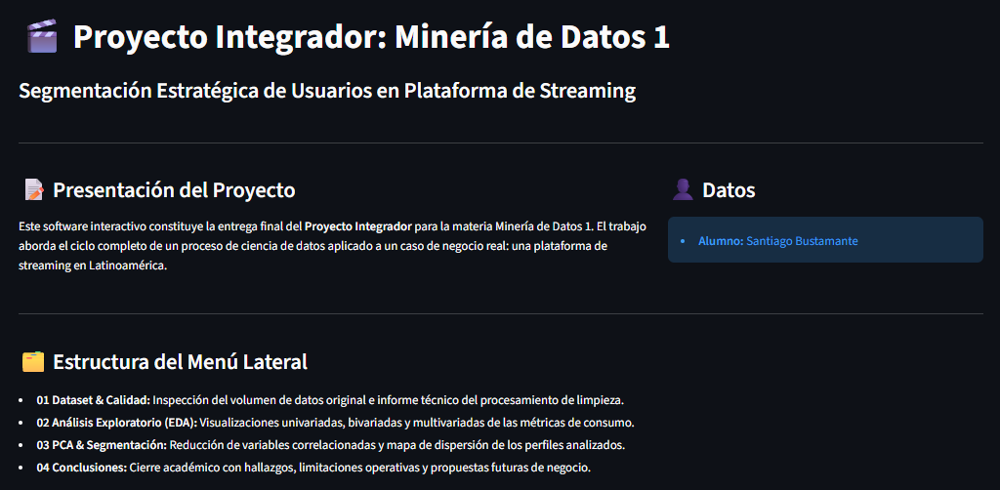
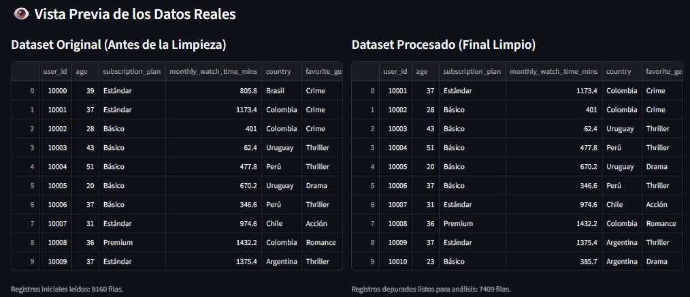
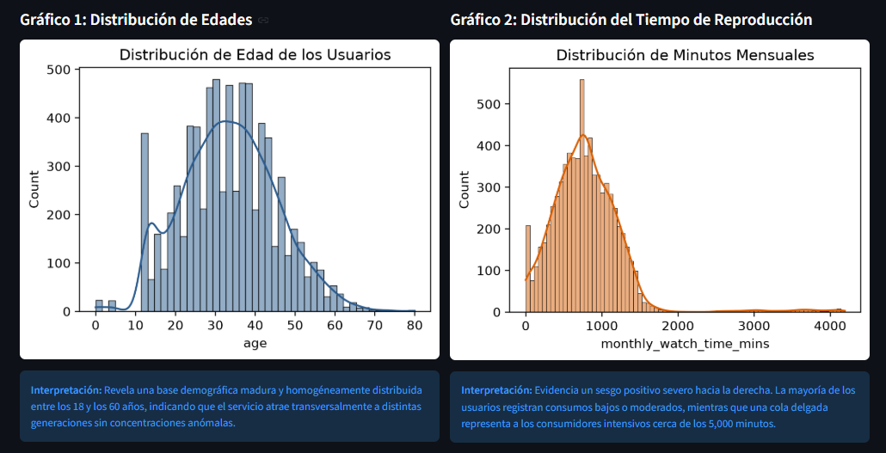
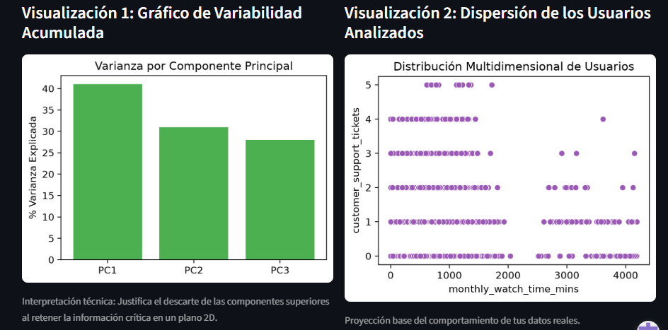
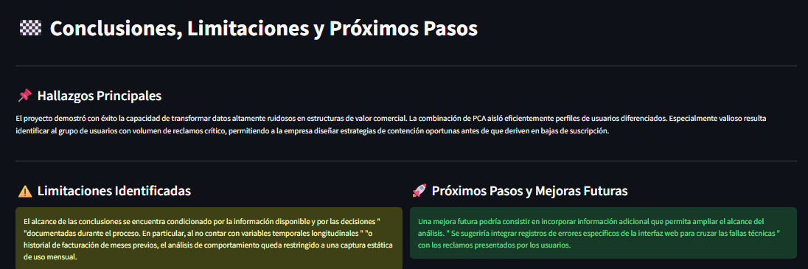

# 📊 Proyecto Integrador — Minería de Datos 1

🚀 **[Ver aplicación interactiva en Streamlit](https://pimineriadatos1-kjpk4kvynnmh4hmnjdqcis.streamlit.app/)**

## 📌 Descripción

Proyecto Integrador de **Minería de Datos 1**, desarrollado individualmente como parte de la formación en **Ciencia de Datos e Inteligencia Artificial**.

El proyecto aborda un proceso completo de análisis de datos, comenzando por la inspección y limpieza del dataset, continuando con el análisis exploratorio (EDA), la aplicación de Análisis de Componentes Principales (PCA) y finalizando con la interpretación de resultados y una aplicación interactiva desarrollada con Streamlit.

---

## 🎯 Objetivo

Analizar un conjunto de datos de usuarios de servicios de streaming para identificar características y patrones relevantes, mejorar la calidad de los datos y aplicar técnicas de reducción de dimensionalidad.

El proceso desarrollado sigue las siguientes etapas:

**Datos brutos → Inspección → Limpieza → EDA → PCA → Conclusiones → Aplicación interactiva**

---

## 🛠️ Tecnologías utilizadas

* Python
* Pandas
* NumPy
* Matplotlib
* Seaborn
* Scikit-learn
* Jupyter Notebook
* Streamlit
* Git
* GitHub

---

## 📂 Dataset

El proyecto trabaja con información de usuarios de servicios de streaming.

### Dataset original

[Ver `streaming_users_dirty.json`](https://github.com/SantiagoBusta-dev/PI_Mineria_Datos_1/blob/main/data/raw/streaming_users_dirty.json)

### Dataset procesado

[Ver `streaming_dataset_limpio.csv`](https://github.com/SantiagoBusta-dev/PI_Mineria_Datos_1/blob/main/data/processed/streaming_dataset_limpio.csv)

---

## 🧹 Limpieza y preparación de datos

Durante esta etapa se realizó el proceso de preparación del dataset para su posterior análisis.

Entre las tareas realizadas se encuentran:

* Inspección inicial de los datos.
* Identificación y tratamiento de valores faltantes.
* Análisis de valores atípicos.
* Revisión y corrección de tipos de datos.
* Transformación de variables.
* Normalización de los datos cuando fue necesario.
* Validación del dataset procesado.

El registro del proceso se encuentra disponible en:

[Ver `pipeline_log.csv`](https://github.com/SantiagoBusta-dev/PI_Mineria_Datos_1/blob/main/logs/pipeline_log.csv)

### Notebooks de esta etapa

* [01 — Inspección inicial](https://github.com/SantiagoBusta-dev/PI_Mineria_Datos_1/blob/main/notebooks/01_inspeccion_inicial.ipynb)
* [02 — Calidad y limpieza](https://github.com/SantiagoBusta-dev/PI_Mineria_Datos_1/blob/main/notebooks/02_calidad_y_limpieza.ipynb)

---

## 📊 Análisis exploratorio de datos — EDA

Se realizó un análisis exploratorio para comprender las características del dataset y detectar patrones, relaciones y comportamientos relevantes mediante estadísticas y visualizaciones.

[Ver notebook de EDA](https://github.com/SantiagoBusta-dev/PI_Mineria_Datos_1/blob/main/notebooks/03_eda.ipynb)

---

## 🔬 Análisis de Componentes Principales — PCA

Se aplicó **PCA (Principal Component Analysis)** como técnica de reducción de dimensionalidad, con el objetivo de representar la información mediante un número reducido de componentes y facilitar su interpretación visual.

[Ver notebook de PCA](https://github.com/SantiagoBusta-dev/PI_Mineria_Datos_1/blob/main/notebooks/04_pca.ipynb)

---

## 🖥️ Aplicación interactiva

El proyecto cuenta con una aplicación desarrollada con **Streamlit**, que permite explorar de manera interactiva los principales resultados obtenidos durante el proceso de análisis.

🚀 **[Abrir aplicación en Streamlit](https://pimineriadatos1-kjpk4kvynnmh4hmnjdqcis.streamlit.app/)**

La aplicación está organizada en las siguientes secciones:

* Dataset
* Análisis exploratorio (EDA)
* PCA
* Conclusiones

### 📸 Capturas de la aplicación

#### 🏠 Inicio



#### 📊 Dataset



#### 📈 Análisis exploratorio — EDA



#### 🔬 Análisis PCA



#### 📝 Conclusiones



### Archivos de la aplicación

* [Home.py](https://github.com/SantiagoBusta-dev/PI_Mineria_Datos_1/blob/main/app/Home.py)
* [01_Dataset.py](https://github.com/SantiagoBusta-dev/PI_Mineria_Datos_1/blob/main/app/pages/01_Dataset.py)
* [02_EDA.py](https://github.com/SantiagoBusta-dev/PI_Mineria_Datos_1/blob/main/app/pages/02_EDA.py)
* [03_PCA.py](https://github.com/SantiagoBusta-dev/PI_Mineria_Datos_1/blob/main/app/pages/03_PCA.py)
* [04_Conclusiones.py](https://github.com/SantiagoBusta-dev/PI_Mineria_Datos_1/blob/main/app/pages/04_Conclusiones.py)

---

## 👨‍💻 Desarrollo del proyecto

El proyecto fue desarrollado individualmente, abarcando las diferentes etapas del proceso de minería de datos:

* Inspección inicial del dataset.
* Limpieza y transformación de los datos.
* Análisis exploratorio.
* Desarrollo de visualizaciones.
* Aplicación de PCA.
* Interpretación de resultados.
* Desarrollo de una aplicación interactiva con Streamlit.
* Organización y documentación del proyecto.

---

## 📁 Estructura del proyecto

```text
PI_Mineria_Datos_1/
│
├── app/
│   ├── Home.py
│   └── pages/
│       ├── 01_Dataset.py
│       ├── 02_EDA.py
│       ├── 03_PCA.py
│       └── 04_Conclusiones.py
│
├── data/
│   ├── processed/
│   │   └── streaming_dataset_limpio.csv
│   └── raw/
│       └── streaming_users_dirty.json
│
├── logs/
│   └── pipeline_log.csv
│
├── notebooks/
│   ├── 01_inspeccion_inicial.ipynb
│   ├── 02_calidad_y_limpieza.ipynb
│   ├── 03_eda.ipynb
│   ├── 04_pca.ipynb
│   └── 05_conclusiones.ipynb
│
├── reports/
│   └── informe_final.pdf
│
├── screenshots/
│   ├── 01_home.png
│   ├── 02_dataset.png
│   ├── 03_eda.png
│   ├── 04_pca.png
│   └── 05_conclusiones.png
│
├── README.md
└── requirements.txt
```

---

## 🔎 Etapas del análisis

| Etapa                 | Notebook                                                                                                                               |
| --------------------- | -------------------------------------------------------------------------------------------------------------------------------------- |
| Inspección inicial    | [01_inspeccion_inicial.ipynb](https://github.com/SantiagoBusta-dev/PI_Mineria_Datos_1/blob/main/notebooks/01_inspeccion_inicial.ipynb) |
| Calidad y limpieza    | [02_calidad_y_limpieza.ipynb](https://github.com/SantiagoBusta-dev/PI_Mineria_Datos_1/blob/main/notebooks/02_calidad_y_limpieza.ipynb) |
| Análisis exploratorio | [03_eda.ipynb](https://github.com/SantiagoBusta-dev/PI_Mineria_Datos_1/blob/main/notebooks/03_eda.ipynb)                               |
| PCA                   | [04_pca.ipynb](https://github.com/SantiagoBusta-dev/PI_Mineria_Datos_1/blob/main/notebooks/04_pca.ipynb)                               |
| Conclusiones          | [05_conclusiones.ipynb](https://github.com/SantiagoBusta-dev/PI_Mineria_Datos_1/blob/main/notebooks/05_conclusiones.ipynb)             |

---

## 📄 Informe final

El informe final del proyecto se encuentra disponible en formato PDF:

[📄 Ver informe final](https://github.com/SantiagoBusta-dev/PI_Mineria_Datos_1/blob/main/reports/informe_final.pdf)

---

## ▶️ Ejecución local

Para ejecutar el proyecto localmente:

```bash
git clone https://github.com/SantiagoBusta-dev/PI_Mineria_Datos_1.git

cd PI_Mineria_Datos_1

pip install -r requirements.txt

streamlit run app/Home.py
```

Las dependencias utilizadas se encuentran en:

[Ver `requirements.txt`](https://github.com/SantiagoBusta-dev/PI_Mineria_Datos_1/blob/main/requirements.txt)

---

## 📝 Conclusiones

El proyecto permitió aplicar de manera práctica diferentes etapas de un proceso de minería de datos, desde la inspección y preparación de los datos hasta el análisis exploratorio, la reducción de dimensionalidad mediante PCA y la comunicación de resultados.

Además, la implementación de una aplicación interactiva con Streamlit permite presentar los resultados de una forma más accesible y facilita la exploración del análisis realizado.

[Ver notebook de conclusiones](https://github.com/SantiagoBusta-dev/PI_Mineria_Datos_1/blob/main/notebooks/05_conclusiones.ipynb)

---

## 👤 Autor

**Santiago Bustamante**

Proyecto desarrollado individualmente como parte de la formación en **Ciencia de Datos e Inteligencia Artificial**.

🔗 [GitHub — Santiago Bustamante](https://github.com/SantiagoBusta-dev)
